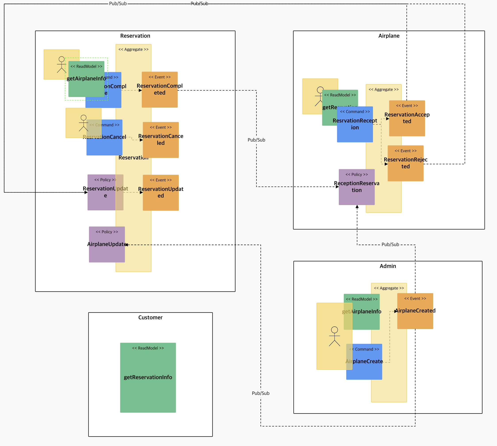
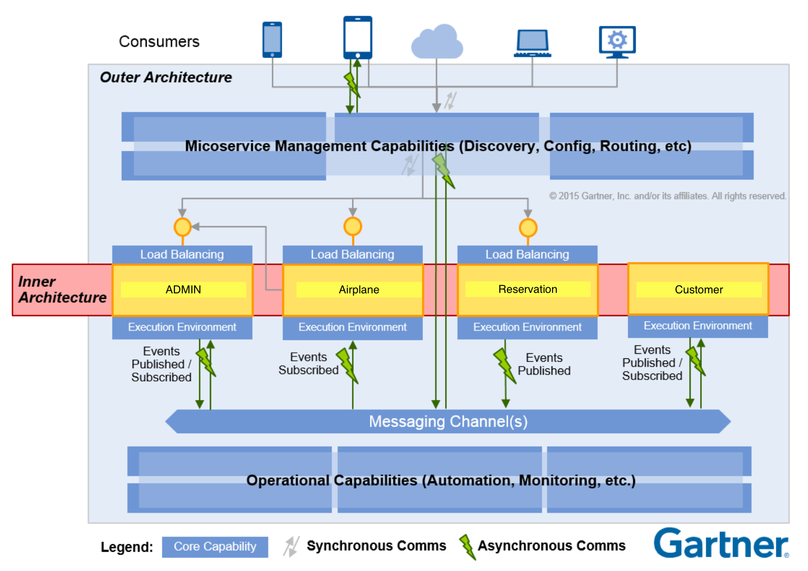
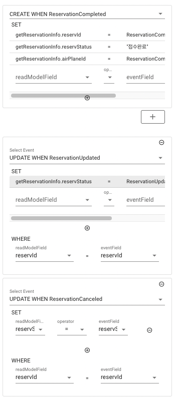
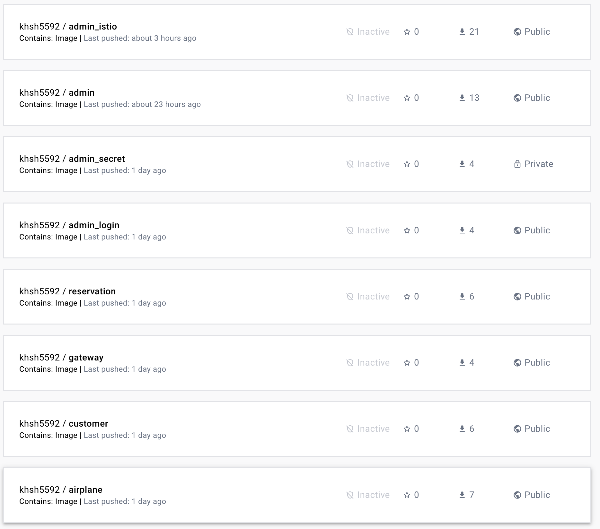
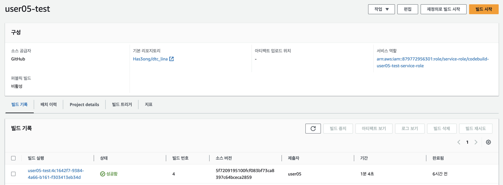
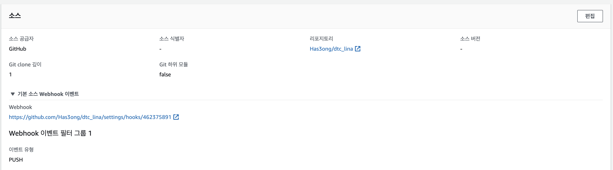
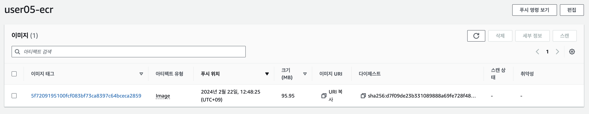
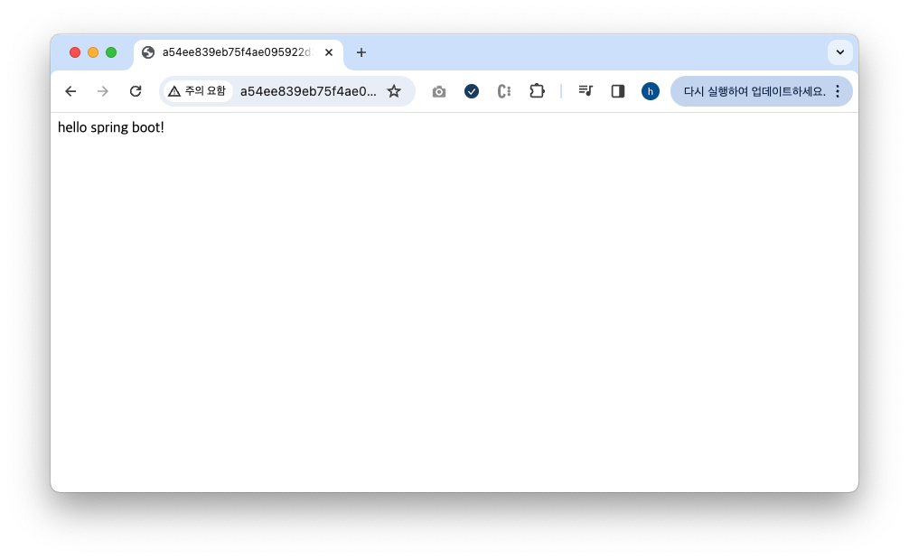
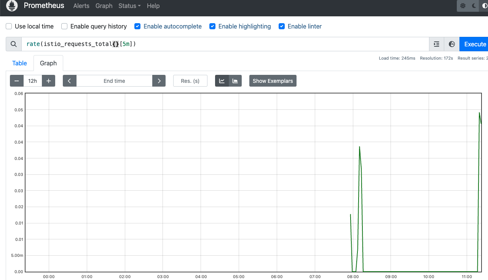

# 예제 - 항공기 예약

## 서비스 시나리오

#### 기능적 요구사항

1. 관리자가 예약할 수 있는 항공기와 좌석 수를 입력한다.
2. 고객은 예약 가능한 항공기를 선택하여 예약한다.
3. 예약이되면 실제로 항공기에 탑승할 수 있는지 확인한 후 최종적으로 승인한다.
4. 만약 예약이 불가하면 예약을 거절한다.
5. 고객페이지에서 예약에 대한 정보를 조회한다.

#### 비기능적 요구사항

1. 비행기 관리 기능이 수행되지 않더라도 예약은 항상 받을 수 있어야 한다.(ASYNC)
2. 고객이 고객페이지에서 예약 상태를 확인할 수 있어야 한다.(CQRS)

### 완성된 모델





### 모델 기능 구현

먼저 Kafka 서버 실행

```shell
$ cd infra
$ docker-compose up
```

이벤트 스토밍으로 작성된 코드를 바탕으로 Spring Boot 실행

```shell
$ cd gateway
$ mvn spring-boot:run

$ cd Admin
$ mvn spring-boot:run

$ cd Member
$ mvn spring-boot:run

$ cd MyPage
$ mvn spring-boot:run

$ cd Reservation
$ mvn spring-boot:run
```

### DDD 적용

각 서비스내에 도출된 핵심 Aggregate Root 객체를 Entity 로 선언하여 개발 진행.

적용 후 REST API TEST

```shell
# 비행기 데이터 추가
$ http POST localhost:8080/admins seatQty=5

Date: Wed, 21 Feb 2024 04:07:21 GMT
Location: http://localhost:8085/admins/1
Vary: Origin
Vary: Access-Control-Request-Method
Vary: Access-Control-Request-Headers
transfer-encoding: chunked

{
    "_links": {
        "admin": {
            "href": "http://localhost:8085/admins/1"
        },
        "self": {
            "href": "http://localhost:8085/admins/1"
        }
    },
    "seatQty": 5
}

# 추가 된 비행기 데이터 조회
$ http GET localhost:8080/airplanes/1

HTTP/1.1 200 OK
Content-Type: application/hal+json
Date: Wed, 21 Feb 2024 04:07:24 GMT
Vary: Origin
Vary: Access-Control-Request-Method
Vary: Access-Control-Request-Headers
transfer-encoding: chunked

{
    "_links": {
        "airplane": {
            "href": "http://localhost:8086/airplanes/1"
        },
        "self": {
            "href": "http://localhost:8086/airplanes/1"
        }
    },
    "reservId": null,
    "reservStatus": null,
    "seatQty": 5
}
```

### 주요 기능 점검

#### 1. 관리자가 예약할 수 있는 항공기와 좌석 수를 입력한다.

```shell
$ http POST localhost:8080/admins seatQty=5

Date: Wed, 21 Feb 2024 04:07:21 GMT
Location: http://localhost:8085/admins/1
Vary: Origin
Vary: Access-Control-Request-Method
Vary: Access-Control-Request-Headers
transfer-encoding: chunked

{
    "_links": {
        "admin": {
            "href": "http://localhost:8085/admins/1"
        },
        "self": {
            "href": "http://localhost:8085/admins/1"
        }
    },
    "seatQty": 5
}
```

#### 2. 고객은 예약 가능한 항공기를 선택하여 예약한다.

```shell
$ http POST localhost:8080/reservations airPlaneId=1

HTTP/1.1 201 Created
Content-Type: application/json
Date: Wed, 21 Feb 2024 04:13:18 GMT
Location: http://localhost:8082/reservations/1
Vary: Origin
Vary: Access-Control-Request-Method
Vary: Access-Control-Request-Headers
transfer-encoding: chunked

{
    "_links": {
        "reservation": {
            "href": "http://localhost:8082/reservations/1"
        },
        "self": {
            "href": "http://localhost:8082/reservations/1"
        }
    },
    "airPlaneId": 1,
    "reservStatus": null
}
```

#### 3. 예약이되면 실제로 항공기에 탑승할 수 있는지 확인한 후 최종적으로 승인한다.

```shell
$ http GET localhost:8080/reservations/1

HTTP/1.1 200 OK
Content-Type: application/hal+json
Date: Wed, 21 Feb 2024 04:20:35 GMT
Vary: Origin
Vary: Access-Control-Request-Method
Vary: Access-Control-Request-Headers
transfer-encoding: chunked

{
    "_links": {
        "reservation": {
            "href": "http://localhost:8082/reservations/1"
        },
        "self": {
            "href": "http://localhost:8082/reservations/1"
        }
    },
    "airPlaneId": 1,
    "reservStatus": "승인"
}
```

#### 4. 만약 예약이 불가하면 예약을 거절한다.

좌석이 5개인 비행기에 6번째 예약이 접수 된 경우, RESERVATION 도메인에서 예약된 데이터 삭제 처리

```shell
$ http POST localhost:8080/reservations airPlaneId=1

HTTP/1.1 201 Created
Content-Type: application/json
Date: Wed, 21 Feb 2024 04:22:18 GMT
Location: http://localhost:8082/reservations/1
Vary: Origin
Vary: Access-Control-Request-Method
Vary: Access-Control-Request-Headers
transfer-encoding: chunked

{
    "_links": {
        "reservation": {
            "href": "http://localhost:8082/reservations/6"
        },
        "self": {
            "href": "http://localhost:8082/reservations/6"
        }
    },
    "airPlaneId": 1,
    "reservStatus": null
}

$ http GET localhost:8080/reservations/6

HTTP/1.1 404 Not Found
Date: Wed, 21 Feb 2024 04:22:30 GMT
Vary: Origin
Vary: Access-Control-Request-Method
Vary: Access-Control-Request-Headers
content-length: 0
```

#### 5. 고객페이지에서 예약에 대한 정보를 조회한다.

```shell
$ http localhost:8090/customers

HTTP/1.1 200 
Connection: keep-alive
Content-Type: application/hal+json
Date: Wed, 21 Feb 2024 05:01:04 GMT
Keep-Alive: timeout=60
Transfer-Encoding: chunked
Vary: Origin
Vary: Access-Control-Request-Method
Vary: Access-Control-Request-Headers

{
    "_embedded": {
        "customers": [
            {
                "_links": {
                    "getReservationInfo": {
                        "href": "http://localhost:8090/customers/1"
                    },
                    "self": {
                        "href": "http://localhost:8090/customers/1"
                    }
                },
                "airPlaneId": 1,
                "reservStatus": "접수완료"
            },
            {
                "_links": {
                    "getReservationInfo": {
                        "href": "http://localhost:8090/customers/2"
                    },
                    "self": {
                        "href": "http://localhost:8090/customers/2"
                    }
                },
                "airPlaneId": 1,
                "reservStatus": "접수완료"
            }
        ]
    },
######################## 중략 ########################
}
```

## 클라우드 네이티브 개발

### Saga

각 도메인에서 생성된 이벤트는 Kafka Topic 으로 들어간 후 메세지를 구독하여 이벤트로 처리하는 방식으로 진행.

```shell
{"eventType":"AirplaneCreated","timestamp":1708489195994,"airPlaneId":1,"seatQty":5}

{"eventType":"ReservationCompleted","timestamp":1708489208869,"reservId":1,"airPlaneId":1}
{"eventType":"ReservationApproved","timestamp":1708489208992,"airPlaneId":1,"reservId":1,"reservStatus":"승인"}
{"eventType":"ReservationUpdated","timestamp":1708489209082,"reservId":1,"airPlaneId":1,"reservStatus":"승인"}
```

### Compesnation

예약한 비행기의 좌석 수량이 부족한 경우 자동으로 예약 거절 이벤트가 발행이 되며, RESERVATION 도메인에서 데이터가 삭제 됨.

```shell
{"eventType":"AirplaneCreated","timestamp":1708489195994,"airPlaneId":1,"seatQty":5}

{"eventType":"ReservationCompleted","timestamp":1708489208869,"reservId":1,"airPlaneId":1}
{"eventType":"ReservationApproved","timestamp":1708489208992,"airPlaneId":1,"reservId":1,"reservStatus":"승인"}
{"eventType":"ReservationUpdated","timestamp":1708489209082,"reservId":1,"airPlaneId":1,"reservStatus":"승인"}

{"eventType":"ReservationCompleted","timestamp":1708489334116,"reservId":2,"airPlaneId":1}
{"eventType":"ReservationApproved","timestamp":1708489334126,"airPlaneId":1,"reservId":2,"reservStatus":"승인"}
{"eventType":"ReservationUpdated","timestamp":1708489334135,"reservId":2,"airPlaneId":1,"reservStatus":"승인"}

{"eventType":"ReservationCompleted","timestamp":1708489335410,"reservId":3,"airPlaneId":1}
{"eventType":"ReservationApproved","timestamp":1708489335419,"airPlaneId":1,"reservId":3,"reservStatus":"승인"}
{"eventType":"ReservationUpdated","timestamp":1708489335427,"reservId":3,"airPlaneId":1,"reservStatus":"승인"}

{"eventType":"ReservationCompleted","timestamp":1708489336691,"reservId":4,"airPlaneId":1}
{"eventType":"ReservationApproved","timestamp":1708489336700,"airPlaneId":1,"reservId":4,"reservStatus":"승인"}
{"eventType":"ReservationUpdated","timestamp":1708489336709,"reservId":4,"airPlaneId":1,"reservStatus":"승인"}

{"eventType":"ReservationCompleted","timestamp":1708489337922,"reservId":5,"airPlaneId":1}
{"eventType":"ReservationApproved","timestamp":1708489337933,"airPlaneId":1,"reservId":5,"reservStatus":"승인"}
{"eventType":"ReservationUpdated","timestamp":1708489337963,"reservId":5,"airPlaneId":1,"reservStatus":"승인"}


{"eventType":"ReservationCompleted","timestamp":1708489339273,"reservId":6,"airPlaneId":1}
{"eventType":"ReservationRejected","timestamp":1708489339291,"airPlaneId":1,"reservId":6,"reservStatus":"취소"}
```

### Gateway

모든 API는 게이트웨이 진입점을 통하여 서비스에 접근이 된다.

```shell
$ http POST localhost:8080/admins seatQty=5
$ http GET localhost:8080/airplanes/1
$ http POST localhost:8080/reservations airPlaneId=1
```

### CQRS

다른 도메인의 서비스의 데이터 원본에 접근없이 내 서비스에서의 데이터 조회가 가능하다.



```shell
$ http localhost:8090/customers

HTTP/1.1 200 
Connection: keep-alive
Content-Type: application/hal+json
Date: Wed, 21 Feb 2024 05:01:04 GMT
Keep-Alive: timeout=60
Transfer-Encoding: chunked
Vary: Origin
Vary: Access-Control-Request-Method
Vary: Access-Control-Request-Headers

{
    "_embedded": {
        "customers": [
            {
                "_links": {
                    "getReservationInfo": {
                        "href": "http://localhost:8090/customers/8"
                    },
                    "self": {
                        "href": "http://localhost:8090/customers/8"
                    }
                },
                "airPlaneId": 1,
                "reservStatus": "접수완료"
            },
            {
                "_links": {
                    "getReservationInfo": {
                        "href": "http://localhost:8090/customers/9"
                    },
                    "self": {
                        "href": "http://localhost:8090/customers/9"
                    }
                },
                "airPlaneId": 1,
                "reservStatus": "접수완료"
            }
        ]
    },
    "page": {
        "number": 0,
        "size": 20,
        "totalElements": 2,
        "totalPages": 1
    }
}
```

## 클라우드 네이티브 운영

### 클라우드 배포 - Container 운영

각각의 도메인 서비스를 컨테이너 기반으로 운영하기 위하여 Docker Hub 에 Push한다.

```shell
$ docker build -t khsh5592/admin:240221 .
$ docker build -t khsh5592/airplane:240221 .
$ docker build -t khsh5592/customer:240221 .
$ docker build -t khsh5592/gateway:240221 .
$ docker build -t khsh5592/reservation:240221 .

$ docker images
REPOSITORY                  TAG       IMAGE ID       CREATED          SIZE
khsh5592/reservation        240221    5f10928dce29   3 seconds ago    417MB
khsh5592/gateway            240221    6694d7370865   21 seconds ago   130MB
khsh5592/customer           240221    7cf0adff92df   50 seconds ago   417MB
khsh5592/airplane           240221    30e430d78d00   2 minutes ago    417MB
khsh5592/admin              240221    a2afe95f4d02   2 minutes ago    417MB

$ docker push khsh5592/admin:240221
$ docker push khsh5592/airplane:240221
$ docker push khsh5592/customer:240221
$ docker push khsh5592/gateway:240221
$ docker push khsh5592/reservation:240221
```

올라간 Docker Hub 모습



### AWS Codebuild / ECR 기반으로 Container 배포

AWS의 CodeBuild 서비스를 이용하여 Github에 연동된 dtc_lina 저장소에서 PUSH 이벤트가 발생할 때마다 비륻가 되도록 WebHook 이벤트 설정하였으며,





buildspec.yaml 을 이용하여 gateway를 빌드하였음

```yaml
# buildspec.yaml
version: 0.2

env:
  variables:
    IMAGE_REPO_NAME: "user05-ecr"

phases:
  install:
    runtime-versions:
      java: corretto17
      docker: 20
  pre_build:
    commands:
      - cd gateway
      - echo =========================-==============================
      - pwd
      - echo =======================================================
      - echo Logging in to Amazon ECR...
      - echo $IMAGE_REPO_NAME
      - echo $AWS_ACCOUNT_ID
      - echo $AWS_DEFAULT_REGION
      - echo $CODEBUILD_RESOLVED_SOURCE_VERSION
      - echo start command
      - $(aws ecr get-login --no-include-email --region $AWS_DEFAULT_REGION)
  build:
    commands:
      - echo Build started on `date`
      - echo Building the Docker image...
      - mvn package -Dmaven.test.skip=true
      - docker build -t $AWS_ACCOUNT_ID.dkr.ecr.$AWS_DEFAULT_REGION.amazonaws.com/$IMAGE_REPO_NAME:$CODEBUILD_RESOLVED_SOURCE_VERSION  .
  post_build:
    commands:
      - echo Build completed on `date`
      - echo Pushing the Docker image...
      - docker push $AWS_ACCOUNT_ID.dkr.ecr.$AWS_DEFAULT_REGION.amazonaws.com/$IMAGE_REPO_NAME:$CODEBUILD_RESOLVED_SOURCE_VERSION

#cache:
#  paths:
#    - '/root/.m2/**/*'
```

빌드가 완료되면 `user05-ecr` 이라는 ECR에 이미지가 올라가게 된다.



## 컨테이너 인프라 설계 및 구성 역량

### HPA

ReplicaSet을 활용한 Scale-Out 을 구현한다.

아래와 같이 YAML 파일을 생성한다.

```shell
$ vi hpa.yaml
apiVersion: apps/v1
kind: Deployment
metadata:
  name: admin
  labels:
    app: admin
spec:
  replicas: 1
  selector:
    matchLabels:
      app: admin
  template:
    metadata:
      labels:
        app: admin
    spec:
      containers:
        - name: admin
          image: khsh5592/admin:240221
          ports:
            - containerPort: 8080
          resources:
            requests:
              cpu: "200m"            
          readinessProbe:
            httpGet:
              path: '/actuator/health'
              port: 8080
            initialDelaySeconds: 10
            timeoutSeconds: 2
            periodSeconds: 5
            failureThreshold: 10
          livenessProbe:
            httpGet:
              path: '/actuator/health'
              port: 8080
            initialDelaySeconds: 120
            timeoutSeconds: 2
            periodSeconds: 5
            failureThreshold: 5
```

만들어진 YAML 파일을 kubectl 이용하여 생성하고, 오토 스케일링 설정 명령어를 호출한다.

```shell
$ kubectl apply -f hpa.yaml
$ kubectl autoscale deployment admin --cpu-percent=50 --min=1 --max=3
```

만들어진 모습

```shell
$ kubectl get all
NAME                         READY   STATUS    RESTARTS   AGE
pod/admin-6786557949-tdv5m   0/1     Running   0          3s
pod/my-kafka-0               1/1     Running   0          31m
pod/siege                    1/1     Running   0          20m

NAME                        TYPE        CLUSTER-IP      EXTERNAL-IP   PORT(S)                      AGE
service/admin               ClusterIP   10.100.27.218   <none>        8080/TCP                     7m35s
service/kubernetes          ClusterIP   10.100.0.1      <none>        443/TCP                      98m
service/my-kafka            ClusterIP   10.100.55.246   <none>        9092/TCP                     31m
service/my-kafka-headless   ClusterIP   None            <none>        9092/TCP,9094/TCP,9093/TCP   31m

NAME                    READY   UP-TO-DATE   AVAILABLE   AGE
deployment.apps/admin   0/1     1            0           4s

NAME                               DESIRED   CURRENT   READY   AGE
replicaset.apps/admin-6786557949   1         1         0       4s

NAME                        READY   AGE
statefulset.apps/my-kafka   1/1     31m

NAME                                        REFERENCE          TARGETS   MINPODS   MAXPODS   REPLICAS   AGE
horizontalpodautoscaler.autoscaling/admin   Deployment/admin   4%/50%    1         3         1          103s
```

부하 생성기 siege 라는 파드를 생성해준다.

```shell
$ kubectl apply -f - <<EOF
apiVersion: v1
kind: Pod
metadata:
  name: siege
spec:
  containers:
  - name: siege
    image: apexacme/siege-nginx
EOF
```

생성된 siege 파드에 접속하여 부하를 발생시킨다.

```shell
$ kubectl exec -it siege -- /bin/sh
$ siege -c20 -t40S -v http://10.100.27.218:8080/
```

Auto Scale-Out 된 걸 확인한 모습

```shell
$ kubectl get all
NAME                         READY   STATUS    RESTARTS   AGE
pod/admin-6786557949-jxh74   1/1     Running   0          45s
pod/admin-6786557949-kbm7t   1/1     Running   0          45s
pod/admin-6786557949-tdv5m   1/1     Running   0          105s
pod/my-kafka-0               1/1     Running   0          32m
pod/siege                    1/1     Running   0          21m

NAME                        TYPE        CLUSTER-IP      EXTERNAL-IP   PORT(S)                      AGE
service/admin               ClusterIP   10.100.27.218   <none>        8080/TCP                     9m16s
service/kubernetes          ClusterIP   10.100.0.1      <none>        443/TCP                      100m
service/my-kafka            ClusterIP   10.100.55.246   <none>        9092/TCP                     32m
service/my-kafka-headless   ClusterIP   None            <none>        9092/TCP,9094/TCP,9093/TCP   32m

NAME                    READY   UP-TO-DATE   AVAILABLE   AGE
deployment.apps/admin   3/3     3            3           106s

NAME                               DESIRED   CURRENT   READY   AGE
replicaset.apps/admin-6786557949   3         3         3       106s

NAME                        READY   AGE
statefulset.apps/my-kafka   1/1     32m

NAME                                        REFERENCE          TARGETS    MINPODS   MAXPODS   REPLICAS   AGE
horizontalpodautoscaler.autoscaling/admin   Deployment/admin   508%/50%   1         3         3          3m25s
```

### ConfigMap

진행 전 application-resource.yaml 파일에 logging 이 추가된 docker image를 사용한다.

로그 레벨을 ConfigMap에 저장하여 관리

```yaml
logging:
  level:
    root: ${ORDER_LOG_LEVEL}
    org:
      hibernate:
        SQL: ${ORDER_LOG_LEVEL}
      springframework:
        cloud: ${ORDER_LOG_LEVEL}

```

```shell
$ kubectl apply -f - <<EOF
apiVersion: v1
kind: ConfigMap
metadata:
  name: config-dev
  namespace: default
data:
  ORDER_DB_URL: jdbc:mysql://mysql:3306/connectdb1?serverTimezone=Asia/Seoul&useSSL=false
  ORDER_DB_USER: myuser
  ORDER_DB_PASS: mypass
  ORDER_LOG_LEVEL: DEBUG
EOF
```

```shell
$ kubectl get configmap
NAME               DATA   AGE
config-dev         4      77s
kube-root-ca.crt   1      123m
my-kafka-scripts   1      56m
```

스펙에 아래와 같이 ENV 변수 추가

```shell
$ vi configmap.yaml
apiVersion: apps/v1
kind: Deployment
metadata:
  name: admin
  labels:
    app: admin
spec:
  replicas: 1
  selector:
    matchLabels:
      app: admin
  template:
    metadata:
      labels:
        app: admin
    spec:
      containers:
        - name: admin
          image: khsh5592/admin_login:240221
          ports:
            - containerPort: 8080
          env:
            - name: ORDER_LOG_LEVEL
              valueFrom:
                configMapKeyRef:
                  name: config-dev
                  key: ORDER_LOG_LEVEL
          resources:
            requests:
              cpu: "200m"            
          readinessProbe:
            httpGet:
              path: '/actuator/health'
              port: 8080
            initialDelaySeconds: 10
            timeoutSeconds: 2
            periodSeconds: 5
            failureThreshold: 10
          livenessProbe:
            httpGet:
              path: '/actuator/health'
              port: 8080
            initialDelaySeconds: 120
            timeoutSeconds: 2
            periodSeconds: 5
            failureThreshold: 5
```

```shell
$ kubectl apply -f configmap.yaml
$ kubectl get pod
NAME                     READY   STATUS                       RESTARTS   AGE
admin-699964ccd8-qxn7h   1/1     Running                      0          31s
```

DEBUG 로그 확인

```shell
$ kubectl logs -l app=admin
2024-02-21 16:43:20.662 DEBUG [admin,,,] 1 --- [           main] o.s.b.f.s.DefaultListableBeanFactory     : Autowiring by type from bean name 'messageSourceFactory' via factory method to bean named 'integrationArgumentResolverMessageConverter'
2024-02-21 16:43:20.662 DEBUG [admin,,,] 1 --- [           main] o.s.b.f.s.DefaultListableBeanFactory     : Autowiring by type from bean name 'messageSourceFactory' via factory method to bean named 'compositeMessageChannelConfigurer'
2024-02-21 16:43:20.671 DEBUG [admin,,,] 1 --- [           main] o.s.b.f.s.DefaultListableBeanFactory     : Creating shared instance of singleton bean 'org.springframework.boot.context.properties.ConfigurationBeanFactoryMetadata'
2024-02-21 16:43:20.680 DEBUG [admin,,,] 1 --- [           main] o.s.b.f.s.DefaultListableBeanFactory     : Creating shared instance of singleton bean 'channelInitializer'
2024-02-21 16:43:20.688 DEBUG [admin,,,] 1 --- [           main] o.s.b.f.s.DefaultListableBeanFactory     : Creating shared instance of singleton bean 'mergedIntegrationGlobalProperties'
2024-02-21 16:43:20.722 DEBUG [admin,,,] 1 --- [           main] o.s.b.f.s.DefaultListableBeanFactory     : Creating shared instance of singleton bean '$autoCreateChannelCandidates'
2024-02-21 16:43:20.733 DEBUG [admin,,,] 1 --- [           main] o.s.b.f.s.DefaultListableBeanFactory     : Creating shared instance of singleton bean 'event-in'
2024-02-21 16:43:20.734 DEBUG [admin,,,] 1 --- [           main] o.s.b.f.s.DefaultListableBeanFactory     : Creating shared instance of singleton bean 'airplane.config.kafka.KafkaProcessor'
2024-02-21 16:43:20.751 DEBUG [admin,,,] 1 --- [           main] o.s.b.f.s.DefaultListableBeanFactory     : Creating shared instance of singleton bean 'event-in'
2024-02-21 16:43:20.786 DEBUG [admin,,,] 1 --- [           main] o.s.b.f.s.DefaultListableBeanFactory     : Creating shared instance of singleton bean 'event-out'
```

LOG_LEVEL을 INFO 로 바꾼 후 configmap 을 다시 생성하고 파드를 다시 배포한다.

```shell
kubectl apply -f - <<EOF
apiVersion: v1
kind: ConfigMap
metadata:
  name: config-dev
  namespace: default
data:
  ORDER_DB_URL: jdbc:mysql://mysql:3306/connectdb1?serverTimezone=Asia/Seoul&useSSL=false
  ORDER_DB_USER: myuser
  ORDER_DB_PASS: mypass
  ORDER_LOG_LEVEL: INFO
EOF
```

```shell
kubectl delete -f configmap.yaml
kubectl apply -f configmap.yaml
```

```shell
$ kubectl logs -l app=admin
        ssl.trustmanager.algorithm = PKIX
        ssl.truststore.location = null
        ssl.truststore.password = null
        ssl.truststore.type = JKS
        value.deserializer = class org.apache.kafka.common.serialization.ByteArrayDeserializer

2024-02-21 16:44:34.952  INFO [admin,,,] 1 --- [binder-health-1] o.a.kafka.common.utils.AppInfoParser     : Kafka version: 2.5.0
2024-02-21 16:44:34.953  INFO [admin,,,] 1 --- [binder-health-1] o.a.kafka.common.utils.AppInfoParser     : Kafka commitId: 66563e712b0b9f84
2024-02-21 16:44:34.953  INFO [admin,,,] 1 --- [binder-health-1] o.a.kafka.common.utils.AppInfoParser     : Kafka startTimeMs: 1708501474952
2024-02-21 16:44:34.961  INFO [admin,,,] 1 --- [binder-health-1] org.apache.kafka.clients.Metadata        : [Consumer clientId=consumer-3, groupId=null] Cluster ID: kafka_cluster_id_testw
```

### PVC

PVC를 먼저 클러스터에 생성한다.

```shell
$ kubectl apply -f - <<EOF
apiVersion: v1
kind: PersistentVolumeClaim
metadata:
  name: ebs-pvc
  labels:
    app: ebs-pvc
spec:
  accessModes:
  - ReadWriteOnce
  resources:
    requests:
      storage: 1Mi
  storageClassName: ebs-sc
EOF
```

아래와 같이 YAML 스펙을 정의한 다음 배포한다.

```shell
$ vi ebs-pvc.yaml

apiVersion: "apps/v1"
kind: "Deployment"
metadata:
  name: admin
  labels:
    app: "admin"
spec:
  selector:
    matchLabels:
      app: "admin"
  replicas: 1
  template:
    metadata:
      labels:
        app: "admin"
    spec:
      containers:
      - name: "admin"
        image: khsh5592/admin:240221
        ports:
          - containerPort: 8080
        volumeMounts:
          - mountPath: "/mnt/data"
            name: volume
      volumes:
      - name: volume
        persistentVolumeClaim:
          claimName: ebs-pvc
```

생성된 파드에 접속하여 임의의 데이터를 생성한다.

```shell
$ kubectl apply -f ebs-pvc.yaml
$ kubectl exec -it pod/admin-86ccd74d94-zxw7d -- /bin/sh
$ cd /mnt/data
$ touch afsdjkadsfjkhadsfhljkadfslhjkadfsklhjdafshjkladfs.test
$ ls
afsdjkadsfjkhadsfhljkadfslhjkadfsklhjdafshjkladfs.test  lost+found
```

파드를 다시 생성한 후 이전에 생성한 데이터가 존재하는지 확인.

```shell
$ kubectl delete -f ebs-pvc.yaml
$ kubectl apply -f ebs-pvc.yaml

$ kubectl exec -it pod/admin-86ccd74d94-t25wb -- /bin/sh
$ ls /mnt/data
afsdjkadsfjkhadsfhljkadfslhjkadfsklhjdafshjkladfs.test  lost+found
```

생성된 StorgaeClass, PersistentVolumeClaim, PersistentVolume 확인

```shell
$ kubectl get sc
NAME               PROVISIONER             RECLAIMPOLICY   VOLUMEBINDINGMODE      ALLOWVOLUMEEXPANSION   AGE
ebs-sc (default)   ebs.csi.aws.com         Delete          WaitForFirstConsumer   false                  6h55m
gp2                kubernetes.io/aws-ebs   Delete          WaitForFirstConsumer   false                  7h12m

$ kubectl get pvc
NAME              STATUS    VOLUME                                     CAPACITY   ACCESS MODES   STORAGECLASS   AGE
data-my-kafka-0   Bound     pvc-b2bc7399-03fc-4e75-aefe-ba51ff5dc793   8Gi        RWO            ebs-sc         6h5m
ebs-pvc           Bound     pvc-134d195b-317c-4329-8ab6-b706f6818194   1Gi        RWO            ebs-sc         22m
efs-pvc           Pending                                                                        efs-sc         6h47m

$ kubectl get pv
NAME                                       CAPACITY   ACCESS MODES   RECLAIM POLICY   STATUS   CLAIM                         STORAGECLASS   REASON   AGE
pvc-134d195b-317c-4329-8ab6-b706f6818194   1Gi        RWO            Delete           Bound    default/ebs-pvc               ebs-sc                  9m40s
pvc-2a2be729-d3a3-4f8c-a151-0da4eaab6fc3   8Gi        RWO            Delete           Bound    kafka/data-my-kafka-0         ebs-sc                  150m
pvc-68e681c1-0497-4242-91fb-c836f581569a   1Gi        RWO            Delete           Bound    istio-system/storage-loki-0   ebs-sc                  42m
pvc-b2bc7399-03fc-4e75-aefe-ba51ff5dc793   8Gi        RWO            Delete           Bound    default/data-my-kafka-0       ebs-sc                  6h5m
```

### Liveness/Readiness Probe

#### Liveness Probe

아래와 같이 YAML 파일 생성하고 파드를 생성한 후 RESTART 확인

```shell
$ vi liveness2.yaml
apiVersion: apps/v1
kind: Deployment
metadata:
  name: admin
  labels:
    app: admin
spec:
  replicas: 1
  selector:
    matchLabels:
      app: admin
  template:
    metadata:
      labels:
        app: admin
    spec:
      containers:
        - name: admin
          image: khsh5592/admin:240221
          ports:
            - containerPort: 8080
          livenessProbe:
            exec:
              command:
              - cat
              - /tmp/healthy
            initialDelaySeconds: 3
            periodSeconds: 5
```

```shell
$ kubectl apply -f liveness2.yaml
$ kubectl get pod/admin-6c6f6999dc-g22wk -w
NAME                     READY   STATUS    RESTARTS   AGE
admin-6c6f6999dc-g22wk   1/1     Running   0          12s
admin-6c6f6999dc-g22wk   1/1     Running   1 (1s ago)   16s
admin-6c6f6999dc-g22wk   1/1     Running   2 (1s ago)   31s
admin-6c6f6999dc-g22wk   1/1     Running   3 (2s ago)   47s
admin-6c6f6999dc-g22wk   0/1     CrashLoopBackOff   3 (1s ago)   61s
admin-6c6f6999dc-g22wk   1/1     Running            4 (25s ago)   85s
admin-6c6f6999dc-g22wk   1/1     Running            5 (1s ago)    101s
```

#### Readiness Probe

아래와 같이 YAML 파일 생성하고 파드를 생성한다.

```shell
$ vi readliness_service.yaml
apiVersion: "v1"
kind: "Service"
metadata:
  name: "admin"
  labels:
    app: "admin"
spec:
  ports:
    - port: 8080
      targetPort: 8080
  selector:
    app: "admin"
  type: "ClusterIP"
```

```shell
$ vi readliness_deployment.yaml
apiVersion: apps/v1
kind: Deployment
metadata:
  name: admin
  labels:
    app: admin
spec:
  replicas: 1
  selector:
    matchLabels:
      app: admin
  template:
    metadata:
      labels:
        app: admin
    spec:
      containers:
        - name: admin
          image: khsh5592/admin:240221
          ports:
            - containerPort: 8080
          readinessProbe:
            httpGet:
              path: '/admins'
              port: 8080
            initialDelaySeconds: 10
            timeoutSeconds: 2
            periodSeconds: 5
            failureThreshold: 10
```

```shell
$ kubectl apply -f readliness_deployment.yaml
$ kubectl get all

pod/admin-74fc9567fd-xqqrr   1/1     Running   0          2m25s
pod/my-kafka-0               1/1     Running   0          5h9m
pod/siege                    1/1     Running   0          4h58m

NAME                        TYPE        CLUSTER-IP      EXTERNAL-IP   PORT(S)                      AGE
service/admin               ClusterIP   10.100.220.77   <none>        8080/TCP                     77m
service/kubernetes          ClusterIP   10.100.0.1      <none>        443/TCP                      6h16m
service/my-kafka            ClusterIP   10.100.55.246   <none>        9092/TCP                     5h9m
service/my-kafka-headless   ClusterIP   None            <none>        9092/TCP,9094/TCP,9093/TCP   5h9m

NAME                    READY   UP-TO-DATE   AVAILABLE   AGE
deployment.apps/admin   1/1     1            1           5m23s

NAME                               DESIRED   CURRENT   READY   AGE
replicaset.apps/admin-74fc9567fd   0         0         0       3m51s

NAME                        READY   AGE
statefulset.apps/my-kafka   1/1     5h9m
```

기 생성된 siege 파드를 이용하여 부하를 주며, 새로운 이미지의 파드를 생성하여 배포한다.

```shell
$ siege -c1 -t60S -v http://admin:8080/admins --delay=1S

Lifting the server siege...
Transactions:		         116 hits
Availability:		      100.00 %
Elapsed time:		       59.55 secs
Data transferred:	        0.03 MB
Response time:		        0.02 secs
Transaction rate:	        1.95 trans/sec
Throughput:		        0.00 MB/sec
Concurrency:		        0.03
Successful transactions:         116
Failed transactions:	           0
Longest transaction:	        0.05
Shortest transaction:	        0.00
```

```shell
$ kubectl get po -w
NAME                     READY   STATUS    RESTARTS   AGE
admin-74fc9567fd-xqqrr   1/1     Running   0          65s
my-kafka-0               1/1     Running   0          5h6m
siege                    1/1     Running   0          4h55m
admin-8668cccb74-pxhld   0/1     Pending   0          0s
admin-8668cccb74-pxhld   0/1     Pending   0          0s
admin-8668cccb74-pxhld   0/1     ContainerCreating   0          0s
admin-8668cccb74-pxhld   0/1     Running             0          1s
admin-8668cccb74-pxhld   1/1     Running             0          26s
admin-74fc9567fd-xqqrr   1/1     Terminating         0          110s
admin-74fc9567fd-xqqrr   0/1     Terminating         0          110s
admin-74fc9567fd-xqqrr   0/1     Terminating         0          110s
admin-74fc9567fd-xqqrr   0/1     Terminating         0          110s
admin-74fc9567fd-xqqrr   0/1     Terminating         0          110s
```

```shell
$ kubectl get all

pod/admin-8668cccb74-pxhld   1/1     Running   0          2m25s
pod/my-kafka-0               1/1     Running   0          5h9m
pod/siege                    1/1     Running   0          4h58m

NAME                        TYPE        CLUSTER-IP      EXTERNAL-IP   PORT(S)                      AGE
service/admin               ClusterIP   10.100.220.77   <none>        8080/TCP                     77m
service/kubernetes          ClusterIP   10.100.0.1      <none>        443/TCP                      6h16m
service/my-kafka            ClusterIP   10.100.55.246   <none>        9092/TCP                     5h9m
service/my-kafka-headless   ClusterIP   None            <none>        9092/TCP,9094/TCP,9093/TCP   5h9m

NAME                    READY   UP-TO-DATE   AVAILABLE   AGE
deployment.apps/admin   1/1     1            1           5m23s

NAME                               DESIRED   CURRENT   READY   AGE
replicaset.apps/admin-74fc9567fd   0         0         0       3m51s
replicaset.apps/admin-8668cccb74   1         1         1       5m23s

NAME                        READY   AGE
statefulset.apps/my-kafka   1/1     5h9m
```

### Mesh

Istio 설치 후 기본적인 환경 구성

```shell
$ istioctl install --set profile=demo --set hub=gcr.io/istio-release
$ kubectl get all -n istio-system
NAME                                       READY   STATUS    RESTARTS   AGE
pod/grafana-7d4f5589fb-98pss               1/1     Running   0          3h41m
pod/istio-egressgateway-78fd678bcc-gzs5k   1/1     Running   0          3h44m
pod/istio-ingressgateway-5dd585649-hq9kf   1/1     Running   0          3h44m
pod/istiod-bb45db54d-t7bnx                 1/1     Running   0          3h44m
pod/jaeger-58c79c85cd-r6w5t                1/1     Running   0          3h41m
pod/kiali-749d76d7bb-4vgt8                 1/1     Running   0          3h40m
pod/loki-0                                 1/1     Running   0          3h40m
pod/prometheus-5d5d6d6fc-lxb44             2/2     Running   0          3h40m
```

새로운 namespace 생성 및 istio-injection 활성화

```shell
$ kubectl create namespace air
$ kubectl label namespace air istio-injection=enabled
```

생성된 istio-ingressgateway 와 새로운 서비스에 Gateway 및 Service 를 연결

아래 YAML 파일들을 이용하여 배포한다.


```yaml
$ vi airplane-gateway.yaml
apiVersion: networking.istio.io/v1alpha3
kind: Gateway
metadata:
  name: airplane-gateway
spec:
  # The selector matches the ingress gateway pod labels.
  # If you installed Istio using Helm following the standard documentation, this would be "istio=ingress"
  selector:
    istio: ingressgateway # use istio default controller
  servers:
  - port:
      number: 80
      name: http
      protocol: HTTP
    hosts:
    - "*"
---
apiVersion: networking.istio.io/v1alpha3
kind: VirtualService
metadata:
  name: airplane
spec:
  hosts:
  - "*"
  gateways:
  - airplane-gateway
  http:
  - match:
    - uri:
        prefix: /admins
    route:
    - destination:
        host: admin
        port:
          number: 8080
```

```yaml
$ vi airplane.yaml
##################################################################################################
# admin  service
##################################################################################################
apiVersion: v1
kind: Service
metadata:
  name: admin
  labels:
    app: admin
    service: admin
spec:
  ports:
  - port: 8080
    name: http

  selector:
    app: admin
---
apiVersion: v1
kind: ServiceAccount
metadata:
  name: admin-account
  labels:
    account: admin
---
apiVersion: apps/v1
kind: Deployment
metadata:
  name: admin-v1
  labels:
    app: admin
    version: v1
spec:
  replicas: 1
  selector:
    matchLabels:
      app: admin
      version: v1
  template:
    metadata:
      labels:
        app: admin
        version: v1
    spec:
      serviceAccountName: admin-account
      containers:
      - name: admin
        image: khsh5592/admin_istio:240221v3
        ports:
        - containerPort: 8080
```

```shell
$ kubectl apply -f airplane.yaml -n air
$ kubectl apply -f airplane-gateway.yaml -n air
$ kubectl get all -n air

pod/admin-v1-7f4565c58c-bvczd     2/2     Running   0          3h22m

NAME            TYPE        CLUSTER-IP      EXTERNAL-IP   PORT(S)    AGE
service/admin   ClusterIP   10.100.37.238   <none>        8080/TCP   3h39m

NAME                          READY   UP-TO-DATE   AVAILABLE   AGE
deployment.apps/admin-v1      1/1     1            1           3h39m

NAME                                    DESIRED   CURRENT   READY   AGE
replicaset.apps/admin-v1-7f4565c58c     1         1         1       3h23m

$ kubectl get gateway -n air
NAME               AGE
airplane-gateway   3h40m

$ kubectl get serviceaccount -n air
NAME            SECRETS   AGE
admin-account   0         3h40m
default         0         3h41m
```

ingressgateway 의 외부 IP를 조회한 후 접속에 시도한다.

```shell
$ kubectl get svc -n istio-system | grep ingress
istio-ingressgateway   LoadBalancer   10.100.43.196    a54ee839eb75f4ae095922d3bc207f8d-1227081302.ap-southeast-2.elb.amazonaws.com   15021:32746/TCP,80:30376/TCP,443:30338/TCP,31400:31411/TCP,15443:31676/TCP   3h47m
```



### Loggregation/Monitoring

Prometheus 서비스를 실행한다.

```shell
$ kubectl patch service/prometheus -n istio-system -p '{"spec": {"type": "LoadBalancer"}}'
```

아래 쿼리를 이용하여 확인한다.

```shell
$ rate(istio_requests_total{app="admin",destination_service="admin.airplane.svc.cluster.local",response_code="200"}[5m])
```

